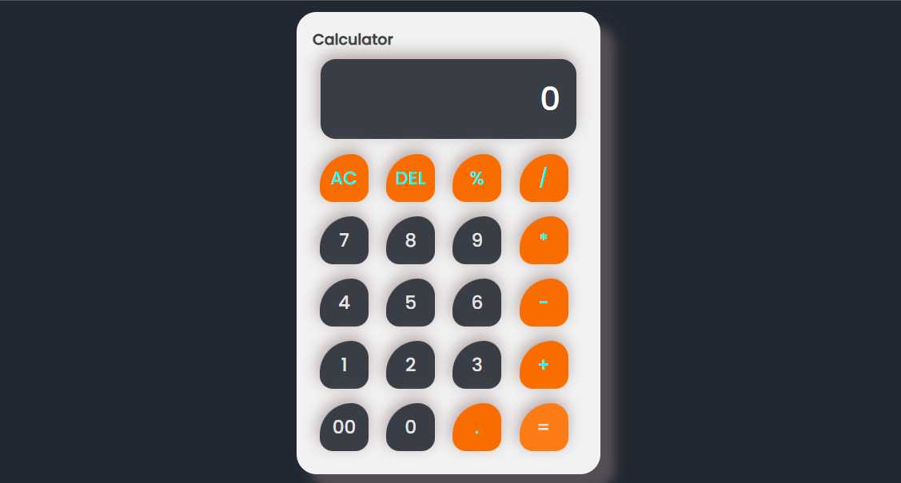

# Calculator

This is a simple calculator project developed by Mohit Patil. It allows users to perform basic arithmetic operations such as addition, subtraction, multiplication, and division.

## Preview


### Features

- **Basic Arithmetic Operations:** Perform addition, subtraction, multiplication, and division.
- **Clear Input:** Use the AC button to clear the input field.
- **Delete Input:** Use the DEL button to delete the last character entered.
- **Modulo Calculation:** Use the % button to calculate percentages.

## Technologies Used

- HTML
- CSS
- JavaScript

## Setup

1. Clone the repository:

```bash
git clone https://github.com/your-username/calculator-project.git

cd calculator-project
```

2. Open the **`index.html`** file in your web browser.

## Usage

- Enter numbers and perform operations using the buttons provided.
- Use the AC button to clear the input field.
- Use the DEL button to delete the last character entered.
- Use the % button to calculate Modulo.
- Press the = button to see the result of the arithmetic operation.

## Credits

**[Mohit Patil](https://www.linkedin.com/in/mohittt-p):** Frontend Developer

## License

This project is licensed under the MIT License - see the LICENSE file for details.


